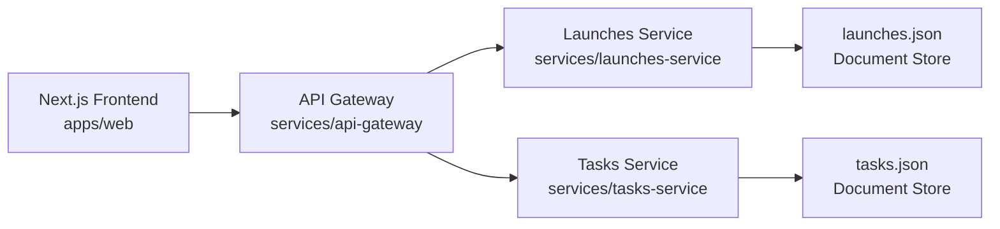

# Zample

Microservices-first React web app for a flavor-launch marketplace, built with Next.js and Tailwind CSS.

Zample connects demand-side companies launching new consumable products with supply-side flavor vendors. The workflow centers on brief intake, vendor matching, sample lifecycle management, and launch execution.

The initial design direction is inspired by Linear's focused, high-contrast productivity feel, with Zample branding and a strong cobalt visual language from your reference materials.

## Architecture

- `apps/web` -> Next.js frontend (React + Tailwind)
- `services/api-gateway` -> routes frontend requests to microservices
- `services/launches-service` -> launch domain service
- `services/tasks-service` -> task domain service
- `packages/document-store` -> shared local JSON document store abstraction



## Getting Started

1. Install dependencies:

```bash
npm install
```

2. Optional: create local env file:

```bash
cp .env.example .env
```

3. Start everything:

```bash
npm run dev
```

4. Open:

- Frontend: `http://localhost:3000`
- API Gateway: `http://localhost:4000/health`
- Launches Service: `http://localhost:4101/health`
- Tasks Service: `http://localhost:4102/health`

## Service APIs

### Launches

- `GET /launches`
- `GET /launches/:id`
- `POST /launches`
- `PATCH /launches/:id`
- `DELETE /launches/:id`

### Tasks

- `GET /tasks`
- `GET /tasks/:id`
- `POST /tasks`
- `PATCH /tasks/:id`
- `DELETE /tasks/:id`

Gateway routes:

- `/api/launches` -> launches service
- `/api/tasks` -> tasks service

## Data Store Strategy (Current)

Each service persists documents in local JSON files:

- `services/launches-service/data/launches.json`
- `services/tasks-service/data/tasks.json`

This intentionally keeps development friction low while preserving a service-owned data boundary.

## AWS Migration Path

The data layer is isolated in `@zample/document-store`, so swapping storage is straightforward.

Recommended evolution path:

1. Keep service boundaries intact, migrate each service independently.
2. Replace JSON-backed document store with DynamoDB-backed adapter per service.
3. Keep API contracts unchanged so frontend and gateway do not need rewrites.
4. Add service auth + IAM roles before production write paths.
5. Add event propagation (EventBridge/SQS) for cross-service reactions later.

Potential target mapping:

- Launches service -> DynamoDB table: `zample-launches`
- Tasks service -> DynamoDB table: `zample-tasks`

## Next Enhancements

- Auth service and organization/user model
- Notifications service for due-date alerts
- Search service (OpenSearch or DynamoDB GSIs)
- CI/CD and containerization (ECS/Fargate or App Runner)
