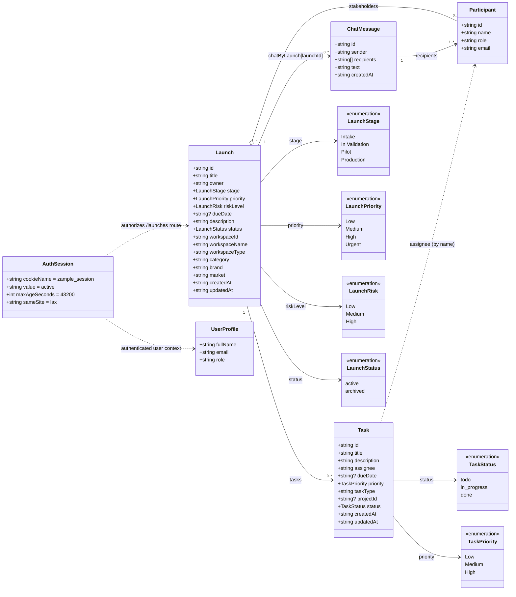

# Zample Object Model

This document captures the current object model implemented in the Zample app and services.

## Diagram

## Mermaid Source

## Notes

- `Launch` maps to the API/service `Project` shape and is persisted in `services/projects-service/data/projects.json`.
- `Task` maps to the API/service `Task` shape and is persisted in `services/tasks-service/data/tasks.json`.
- `Participant` maps to `LaunchParty` and is embedded inside each `Launch` as `stakeholders`.
- `ChatMessage` and `UserProfile` are currently UI-level state models.
- `AuthSession` is currently cookie-based (`zample_session`) and enforced by Next.js middleware.
